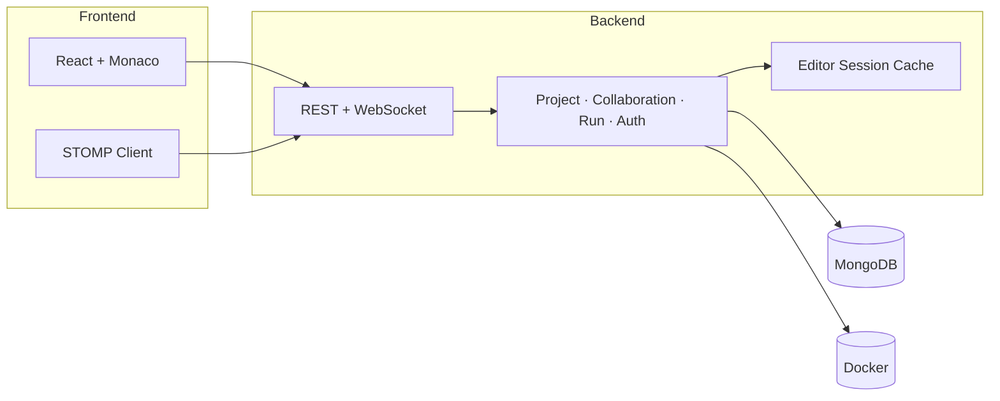
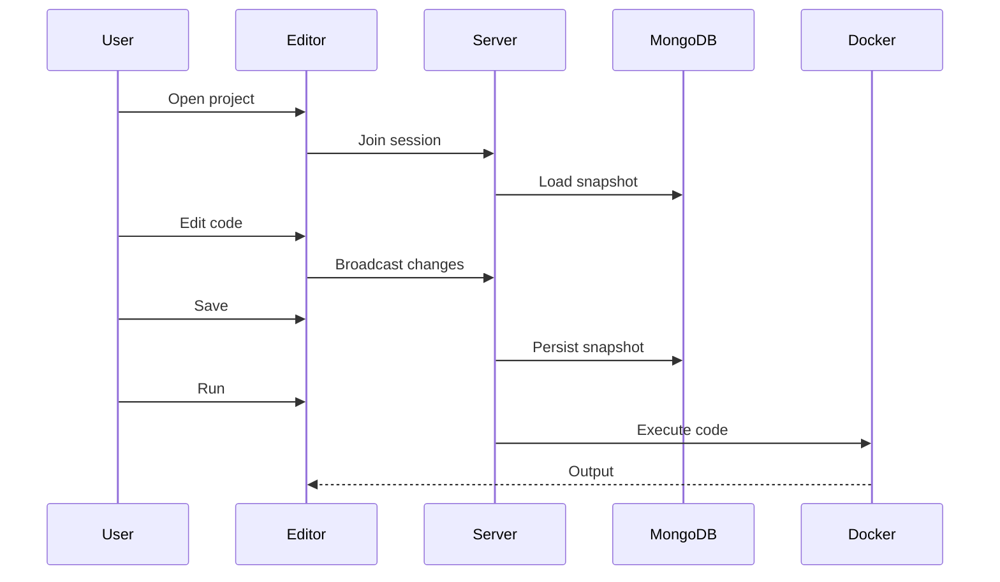

# PairCode

Real-time collaborative code editor. Users work on **Projects** made of source files, edit together over WebSockets, **Save** to MongoDB, and **Run** code in Docker.

[](https://www.youtube.com/watch?v=i8Jdqr6eWaI)

## Tech stack

| | |
|---|---|
| **Frontend** | React, TypeScript, Vite, MUI, Monaco Editor, React Query, STOMP, Axios |
| **Backend** | Java, Spring Boot, Spring Security (JWT), Spring WebSocket/STOMP, Spring Data MongoDB |
| **Data & runtime** | MongoDB, Docker |
| **Testing** | JUnit, Mockito, Vitest |

## Architecture



Live edits happen in an in-memory **editor session**; **Save** writes the snapshot to MongoDB.



## Project structure

```
pairCode/
├── backend/
└── frontend/
```
